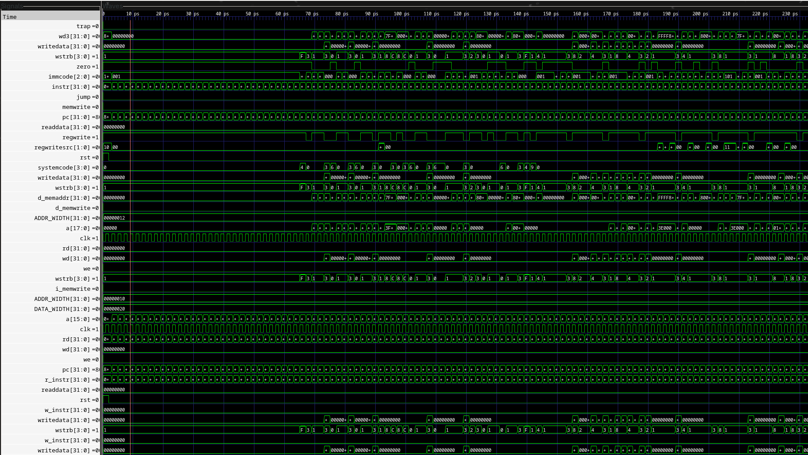

# MGRV (Mega RISC-V)

## Introduction

RV32IM + Zicsr CPU core, written on verilog. Include single-cycle architecture & currently run only in Machine mode priveledge level. Have 2 RAM modules with different ports, for instructions & data. Tested & verified using <https://github.com/riscv-software-src/riscv-tests>. 

Repo structure:
```
├── rtl/
│   ├── top.v             # Top-level integration (CPU + Instruction & Data RAMs)
│   ├── rv32_main.v       # RISC-V core top module
│   ├── datapath.v        # Datapath wiring and execution logic
│   ├── control_unit.v    # Control unit top module
│   ├── maindec.v         # Main opcode decoder
│   ├── aludec.v          # ALU operations decoder
│   ├── branchdec.v       # Branch condition and type decoder
│   ├── systemdec.v       # SYSTEM instruction decoder (EBREAK, ECALL, MRET & Zicsr instructions)
│   ├── systemgen.v       # Generates CSR write data in datapath
│   ├── csraddrdec.v      # Maps 12-bit CSR address to compact 4-bit CSR file address
│   ├── csrfile.v         # Control and Status Register file
│   ├── alu.v             # Arithmetic Logic Unit
│   ├── regfile.v         # General-purpose register file (x0–x31)
│   ├── immgen.v          # Immediate value generator
│   ├── load_aligner.v    # Data alignment for load instructions
│   ├── store_aligner.v   # Data alignment for store instructions
│   ├── dataram32.v       # Data RAM with write-strobe byte selection
│   ├── pcnextgen.v       # Next Program Counter generation logic
│   ├── ram.v             # Generic RAM block
│   ├── adder.v           # Generic adder block
│   ├── flopr.v           # Flip-flop with asynchronous reset
│   ├── mux2.v            # 2-to-1 Multiplexer
│   └── mux4.v            # 4-to-1 Multiplexer
└── sim/
    ├── Makefile          # Build and simulation automation
    ├── tb_top.cpp        # Verilator C++ testbench wrapper specially for riscv-tests
    ├── elfloader.cpp     # ELF binary loader for test memory initialization
    └── elfloader.h       # ELF loader header
```


Datapath Diagram:
<p align="center">
  
</p>

GTKWave wavetrace on running tests:
<p align="center">
  
</p>

## Configuration
You can configure CPU parameters in `rtl/top.v` module:

- `DATARAM_ADDR_WIDTH` - Data RAM size (for 1mb it's must be 18).
- `INSTRRAM_ADDR_WIDTH` - Instructions RAM size.
- `PC_RESET_VALUE` - Value that PC start's after reset (for tests use `0x80000000`).

## Dependencies
- Make
- Verilator

For testing:
- [RISC-V GNU Toolchain](https://github.com/riscv-collab/riscv-gnu-toolchain)
- [RISC-V Software tests](https://github.com/riscv-software-src/riscv-tests)


## Testbench setup
1. Check that all dependencies are installed:
```bash
riscv32-unknown-elf-gcc --version
```

```bash
verilator --version
```

```bash
make --version
```

2. Clone Tests repo & setup ELF tests:
```bash
git clone git@github.com:riscv-software-src/riscv-tests.git

cd riscv-tests
git submodule update --init --recursive 
autoconf  
./configure --prefix=$RISCV/target

make  
make install

```

3. Copy that path to isa directory:
```bash
echo "$(pwd)/isa"
```

4. Go to mgrv repo:
```bash
cd YOUR_PATH/mgrv
```

5. Run testbench using `make` & your path from step 3:
```bash
cd ./sim

make run-all RISCV_TESTS="YOUR_PATH_TO_ISA"
```

If every installed correctly, you must see how testbench tests processing like this:
```
TEST: [rv32ui-p-sw] 
Data size: 1788
INSTR end: 0x1f17
PC end: 0x80000044
STATUS: [PASS]
------------------------------------
TEST: [rv32ui-p-xor] 
Data size: 1724
INSTR end: 0xfc3f2223
PC end: 0x80000040
STATUS: [PASS]
------------------------------------
TEST: [rv32ui-p-xori] 
Data size: 956
INSTR end: 0xfc3f2223
PC end: 0x80000040
STATUS: [PASS]
------------------------------------
All RV32UI tests done
```


If you don't want run every tests, you can run it like this:

- For I extension:
```bash
make run-ui RISCV_TESTS="YOUR_PATH_TO_ISA"
```
- For M extension:
```bash
make run-um RISCV_TESTS="YOUR_PATH_TO_ISA"
```
- For Zicsr extension:
```bash
make run-csr RISCV_TESTS="YOUR_PATH_TO_ISA" 
```
- For running single test (use testname from `riscv-tests/isa` dir):
```bash
make run-test TEST=rv32ui-p-add RISCV_TESTS="YOUR_PATH_TO_ISA" # example with rv32ui-p-add
```


